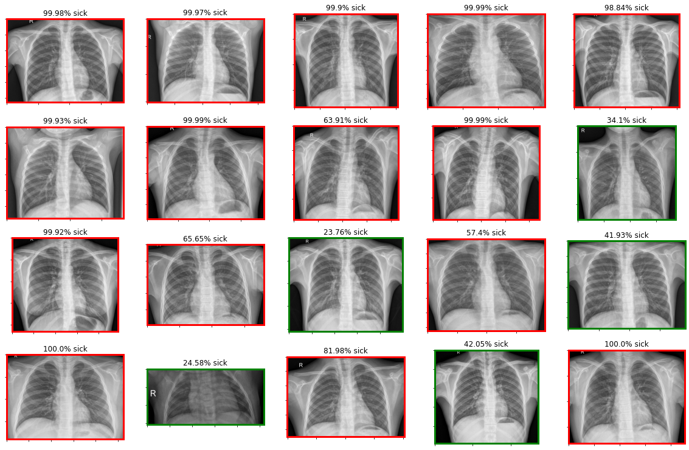
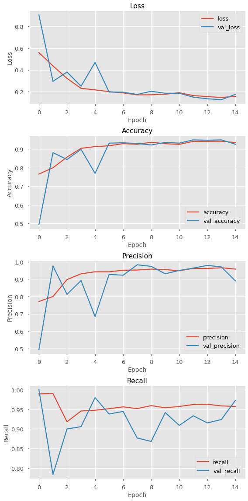

# X-Ray Classification using CNNs

**Author**: [Eric Wehmueller](mailto:ericwehmueller@gmail.com)

## Overview

This project is the fourth project for Flatiron School's bootcamp program in Data Science.  We are being placed into a hypothetical situation as a Data Scientist and hoping to provide value to our business for the scenario we are given.


## Business Problem

A concern in the years 2020 and 2021 has been "flattening the curve" for as to not overwhelm the health care system in the United States, and in other countries as well.  Using image analysis, classification, and convolutional neural networks (CNNs), the goal is to be able to correctly identify x-rays with a pneumonia diagnosis.  There may only be so many radiologists available at any given time- the hope is that something as complicated as xrays, to the untrained human eye, can be correctly read and analyzed by a model generated from a trained CNN.


## Output of Classification



## Model Results



## Project Deliverables

* A GitHub repository
* A Jupyter Notebook
* A non-technical presentation


I explore this thoroughly in the image-classification.ipynb file contained within this repository. 
Image files are already sorted into corresponding folders within the "chest_xray_images" directory with roughly a 70/15/15 distribution between train/test/val folders.


## Repository Structure

```
├── chest_xray_images
├── README.md
├── xray_presentation.pdf
├── xray__notebook.pdf
└── image-classification.ipynb
```